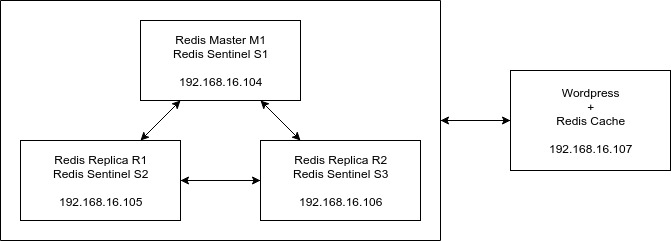

# Redis Cluster using Sentinel
High Available Redis Cluster using Sentinel

## Architecture



## Installation

### Prerequisites

- Vagrant ([Download here](https://www.vagrantup.com/))
- Ubuntu vagrant box ([ubuntu/bionic64](https://app.vagrantup.com/ubuntu/boxes/bionic64))

### Usage

- Running Application

    ```
    vagrant up
    ```

- Stopping Application

    ```
    vagrant halt
    ```

- Destroy Machine
    ```
    vagrant destroy -f
    ```
    
## Configuration Step

### Redis
- Copy konfigurasi default redis ke /etc/redis.conf
    ```
    sudo cp /vagrant/conf/redis.conf /etc/redis.conf
    ```
- Ubah bagian bind ip sesuai ip masing-masing server
    ```
    sudo sed -i "s/bind 127.0.0.1/bind $IP/" /etc/redis.conf
    ```
- Untuk server replica tambahkan "slaveof IP_MASTER PORT"
    ```
    sudo echo "slaveof $IP_MASTER $REDIS_PORT" >> /etc/redis.conf
    ```
- Matikan protected mode
    ```
    sudo sed -i "s/protected-mode yes/protected-mode no/" /etc/redis.conf
    ```
- Ubah bagian daemonize menjadi yes agar proses berjalan di background
    ```
    sudo sed -i "s/daemonize no/daemonize yes/" /etc/redis.conf
    ```
- Jalankan redis menggunakan konfigurasi yang telah disiapkan
    ```
    sudo ./redis-server /etc/redis.conf
    ```

### Sentinel
- Copy konfigurasi default sentinel ke /etc/sentinel.conf
    ```
    sudo cp /vagrant/conf/sentinel.conf /etc/sentinel.conf
    ```
- Ubah bagian bind ip sesuai ip masing-masing server
    ```
    sudo sed -i "s/bind 127.0.0.1/bind $IP/" /etc/sentinel.conf
    ```
- Tambahkan konfigurasi berikut
    ```
    sentinel monitor mymaster 127.0.0.1 6379 2
    sentinel down-after-milliseconds mymaster 5000
    sentinel failover-timeout mymaster 60000
    sentinel parallel-syncs mymaster 1
    ```
- Ubah bagian sentinel monitor sesuai ip redis master yang berjalan
    ```
    sudo sed -i "s/sentinel monitor mymaster 127.0.0.1 6379 2/sentinel monitor mymaster $IP_MASTER $REDIS_PORT 2/" /etc/sentinel.conf
    ```
- Jalankan sentinel menggunakan konfigurasi yang telah disiapkan
    ```
    sudo ./redis-sentinel /etc/sentinel.conf
    ```

### Wordpress
- Install MySQL, Apache, dan PHP
    ```
    sudo apt-get update

    sudo debconf-set-selections <<< 'mysql-server mysql-server/root_password password admin'
    sudo debconf-set-selections <<< 'mysql-server mysql-server/root_password_again password admin'

    sudo apt-get install -y mysql-server
    sudo service mysql restart

    sudo apt-get install -y apache2
    sudo apt-get install -y php libapache2-mod-php php-mysql
    sudo service apache2 restart
    ```
- Install WP-CLI
    ```
    wget https://raw.githubusercontent.com/wp-cli/builds/gh-pages/phar/wp-cli.phar

    sudo chmod +x wp-cli.phar
    sudo mv wp-cli.phar /usr/local/bin/wp
    ```
- Download Wordpress menggunakan WP-CLI
    ```
    sudo -u vagrant mkdir wp
    sudo -u vagrant wp core download --path=wp
    ```
- Buat database untuk Wordpress
    ```
    mysql -u root -padmin -e "CREATE DATABASE wordpress"
    ```
- Install Wordpress
    ```
    sudo -u vagrant wp core config --dbname='wordpress' --dbuser='root' --dbpass='admin' --dbhost='localhost' --dbprefix='wp_' --path=wp
    sudo -u vagrant wp core install --url="$IP" --title='Wordpress' --admin_user='admin' --admin_password='admin' --admin_email='admin@admin.com' --path=wp
    ```
- Install dan aktifkan plugin Redis Object Cache
    ```
    sudo -u vagrant wp plugin install redis-cache --path=wp
    sudo -u vagrant wp plugin activate redis-cache --path=wp
    ```
- Tambahkan konfigurasi berikut pada wp-config.php
    ```
    define( 'WP_REDIS_CLIENT', 'predis' );
    define( 'WP_REDIS_SENTINEL', 'mymaster' );
    define( 'WP_REDIS_SERVERS', [
        'tcp://192.168.16.104:26379',
        'tcp://192.168.16.105:26379',
        'tcp://192.168.16.106:26379',
    ] );
    ```

## Fail-Over Simulation

- Cek ip master yang sedang aktif
    ```
    redis-cli -p 26379 -h 192.168.16.104 sentinel get-master-addr-by-name mymaster
    ```
- Matikan master selama 30 detik
    ```
    redis-cli -p 6379 -h 192.168.16.104 DEBUG sleep 30
    ```
- Cek kembali apakah master sudah berubah
    ```
    redis-cli -p 26379 -h 192.168.16.104 sentinel get-master-addr-by-name mymaster
    ```